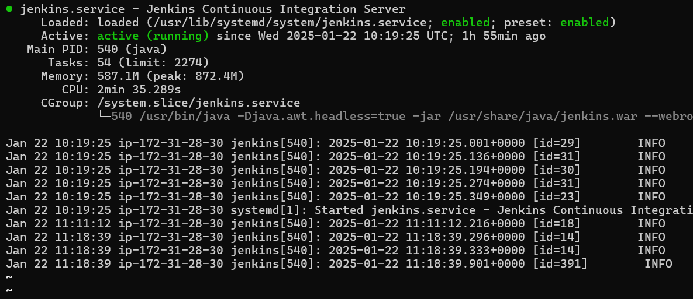
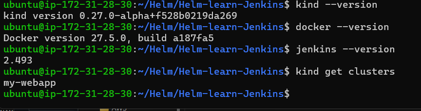
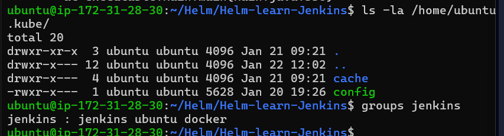
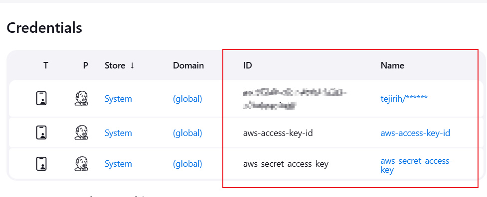
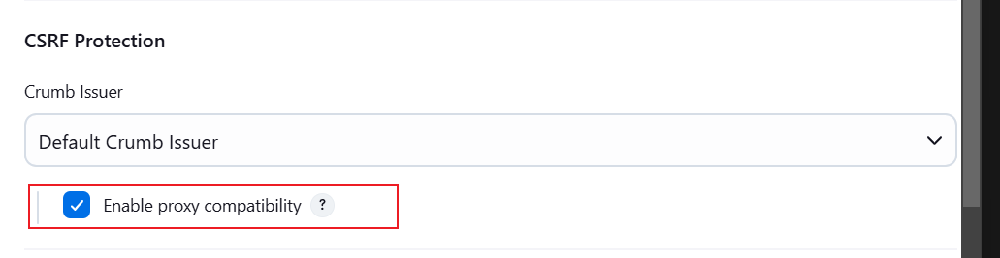
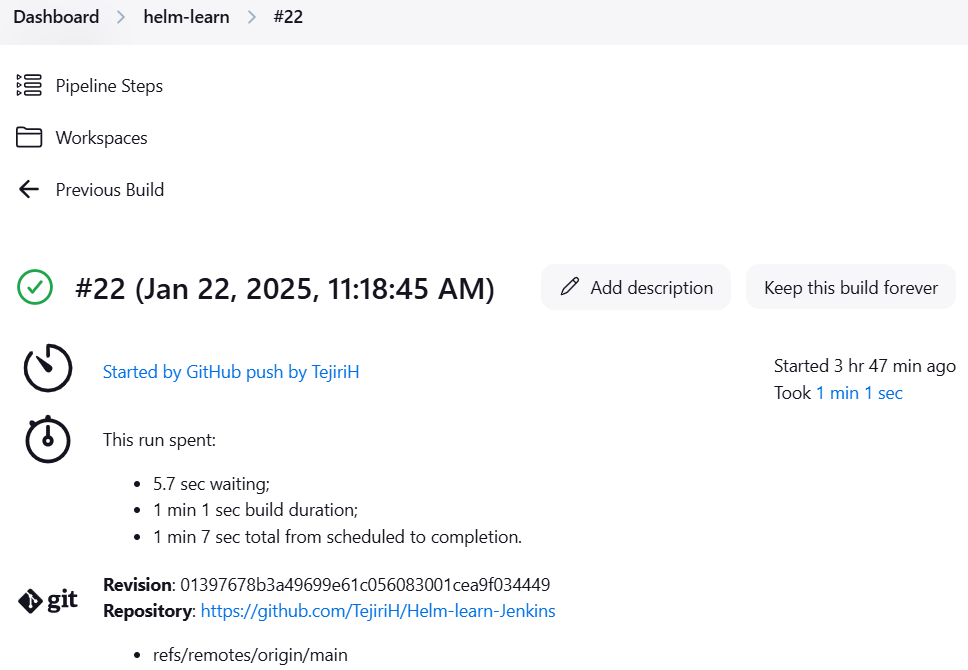

# Configuration Management with Helm using Jenkins

In a bid to understand the basics of Helm charts, we are integrating Helm with Jenkins to design and implement a simplified CI/CD pipeline.

## Objective
To automate the deployment of a basic web application using Helm charts for the management of container orchestration.

---

## Steps

### Step 1: Launch and Configure Server
- Launched an Ubuntu server and installed Docker, Jenkins, and Kind. Assigned port `8080` to Jenkins.
- Added the Jenkins user to the Ubuntu group to access the `~/.kube/config` file.
- Granted read and write permissions to the `.kube/config` file owner and read permissions to the group.

**Images:**
  
  


---

### Step 2: Connect Jenkins to GitHub
- Accessed Jenkins and connected it to GitHub using webhooks.
- In the repository settings, added a webhook with the URL:  
  `http://<server-ip:8080>/github-webhook/`  
- Selected the `application/json` option under content type.

---

### Step 3: Configure Jenkins Pipeline
- Created a new Jenkins item named `Helm`.
- Configured the pipeline to trigger on "GitHub hook trigger for GITScm polling."
- Added the following pipeline script:

```groovy
pipeline {
    agent any

    environment {
        AWS_REGION = 'us-east-1'
        AWS_ACCESS_KEY_ID = credentials('aws-access-key-id')
        AWS_SECRET_ACCESS_KEY = credentials('aws-secret-access-key')
        ECR_URL = 'public.ecr.aws/p3k7l9q4/static-website'  // Your ECR URL
        IMAGE_NAME = 'my-webapp'
        IMAGE_TAG = 'latest'
        RELEASE_NAME = 'webapp-release'  // Helm release name
        HELM_CHART = "$WORKSPACE"  // Path to Helm chart
        KUBECONFIG = '/home/ubuntu/.kube/config'
    }

    stages {
        stage('Checkout') {
            steps {
                git branch: 'main', credentialsId: 'your-credentials-id', url: 'https://github.com/TejiriH/Helm-learn-Jenkins'
                script {
                    sh '''
                    echo "Checking contents of cloned repository..."
                    ls -lah $WORKSPACE
                    '''
                }
            }
        }

        stage('Build Docker Image') {
            steps {
                script {
                    sh '''
                    docker build -t $IMAGE_NAME:$IMAGE_TAG .
                    docker images | grep $IMAGE_NAME
                    '''
                }
            }
        }

        stage('Tag Docker Image for ECR') {
            steps {
                script {
                    sh '''
                    docker tag $IMAGE_NAME:$IMAGE_TAG $ECR_URL:$IMAGE_TAG
                    '''
                }
            }
        }

        stage('Push Docker Image to ECR') {
            steps {
                script {
                    sh '''
                    aws ecr-public get-login-password --region us-east-1 | docker login --username AWS --password-stdin $ECR_URL
                    docker push $ECR_URL:$IMAGE_TAG
                    '''
                }
            }
        }

        stage('Deploy using Helm') {
            steps {
                script {
                    sh '''
                    cd $HELM_CHART
                    helm package .
                    CHART_PACKAGE=$(ls *.tgz | head -n 1)
                    helm upgrade --install $RELEASE_NAME $CHART_PACKAGE \
                        --set image.repository=$ECR_URL \
                        --set image.tag=$IMAGE_TAG \
                        --namespace default
                    '''
                }
            }
        }

        stage('Verify Deployment') {
            steps {
                script {
                    sh '''
                    kubectl get pods
                    sleep 30
                    kubectl get deployments --namespace default
                    kubectl rollout status deployment/$RELEASE_NAME-deployment --namespace default
                    '''
                }
            }
        }
    }

    post {
        success {
            echo 'Deployment completed successfully!'
        }
        failure {
            echo 'Deployment failed!'
        }
    }
}
```

# Jenkins Pipeline for GitHub, Docker, ECR, and Helm Deployment

The script is designed to:
1. Pull the GitHub repository.
2. Build the Docker image.
3. Tag the Docker image for Amazon ECR.
4. Push the Docker image to ECR.
5. Deploy using Helm.
6. Verify the deployment and echo whether the process was successful or failed.

We added our GitHub repository and Jenkins passcode to our secrets, which generated an ID granting Jenkins permission to clone the repository. This can be seen in the following snippet:

```groovy
steps {
    git branch: 'main', credentialsId: 'aec0f2a9-c8cc-4b99-b6b5-a0fa6aac4aa6', url: 'https://github.com/TejiriH/Helm-learn-Jenkins'
}
```       

### Step 4: Secure Access Key and CSRF Protection
To prevent hardcoding and enhance security, I stored my AWS access key and secret in Jenkins' credential store. Additionally, I went to Manage Jenkins → Security and under CSRF Protection, I clicked Enable Proxy Compatibility.





### Step 5: Running the Pipepline
NAfter setting up the pipeline, I ran the build to execute the entire pipepline, and it was successful.


### Challenges: 
We encountered several challenges, as the build failed multiple times before it worked. One of the issues we faced was granting Jenkins permission to log in to Amazon ECR for the Docker push and pull operations. The solution was to use the following snippet:

```
# Login to Amazon ECR using the credentials stored in Jenkins
aws ecr-public get-login-password --region us-east-1 | docker login --username AWS --password-stdin $ECR_URL

```


Additionally, we faced an issue with Jenkins not having permission to access the ~/.kube/config file. To resolve this:

We added Jenkins to the Ubuntu group.
Granted read permissions to the Ubuntu group for the Kubernetes configuration file.
Restarted Jenkins.
These steps allowed Jenkins to access the Kubernetes config file, and the process worked as expected.

### Conclusion:
Finally, we completed the project, and the script ran successfully. We were able to use Helm to deploy a basic website using Jenkins as the CI/CD tool.